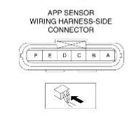
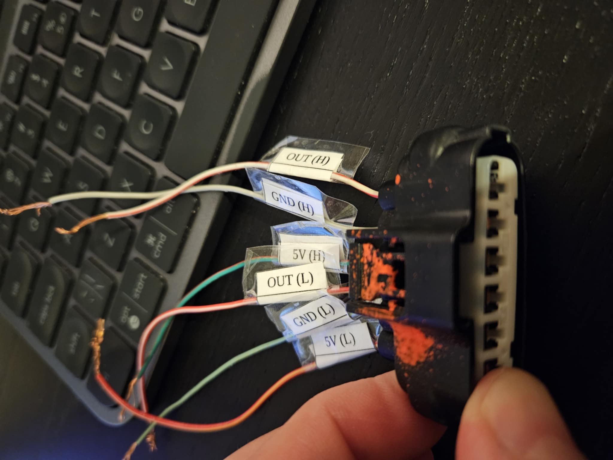
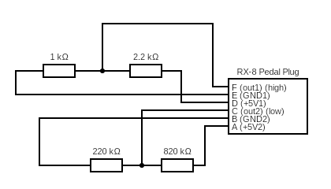

# Mazda RX-8 throttle pedal emulator

Emulator for stock Mazda RX-8 throttle / accelerator pedal required for the stock ECU functions to work without throwing
error code.

This will be placed instead of having a oem rx-8 pedal connected and hidden somewhere under the dash.

## How Mazda pedal works

There are two sensors that have offset of around 0.55 V. Each has independent 5V and GND.

## Pedal plug

 

Pins are numbered looking from the wiring side (backside of the plug).

## Plug pinout

| pin number | wire color       | sensor          | function      |
|------------|------------------|-----------------|---------------|
| F          | white-red        | main (high)     | sensor output |
| E          | gray             | main            | GND           |
| D          | green-red        | main            | +5V           |
| C          | red-white        | secondary (low) | sensor output |
| B          | lightgreen-black | secondary       | GND           |
| A          | red-yellow       | secondary       | +5V           |

## How this emulator work

This will emulate pedal at ~0%, so required voltages for Mazda pedal are:

- ~1.55 volts for main sensor
- ~1 volt for secondary sensor

## Required elements

### High / main sensor

- 2.2kOhm resistor
- 1kOhm resistor

### Low / secondary sensor

- 820kOhm resistor
- 220kOhm resistor

## Circuit Diagram

 

Circuit was drawn using https://www.circuit-diagram.org/.

Source code for the diagram is located in [circuit cddx file](./docs/circuit.cddx)

## Useful links

- [Voltage Divider Calculator](https://www.ti.com/download/kbase/volt/volt_div3.htm) - it takes input and output voltage
  and then provides possible resistors
